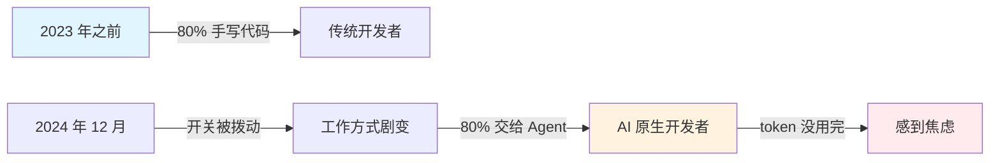
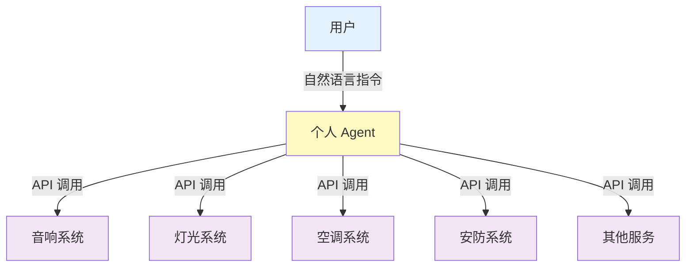
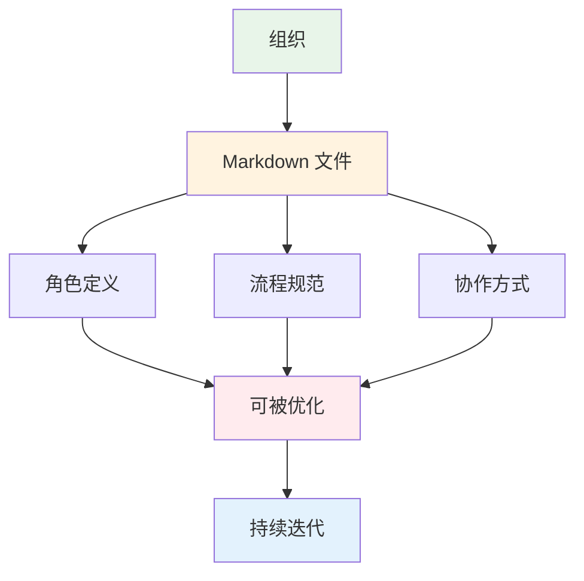
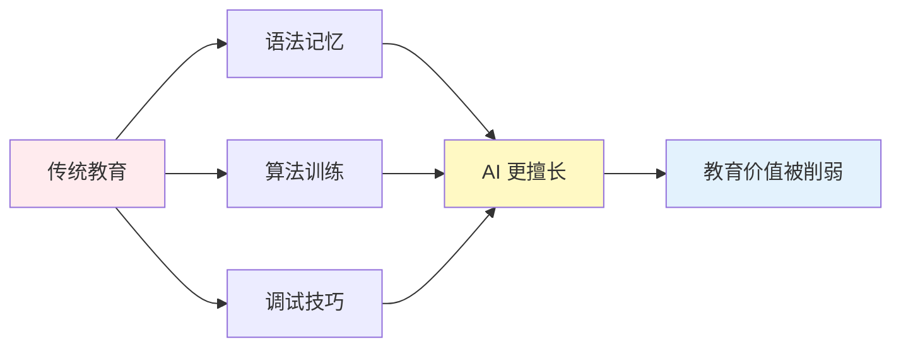
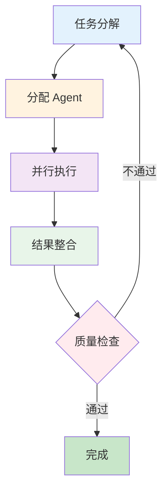

# Andrej Karpathy 最新播客：Token 没用完让人焦虑，就像患上「AI 精神病」

> "我感觉自己病了，患上了严重的 AI 精神病。从去年 12 月开始，我再也没有手写过一行代码。"

🎙️ **播客来源**：No Priors Podcast  
👤 **嘉宾**：Andrej Karpathy（前 OpenAI 研究科学家、特斯拉 AI 前总监）  
⏱️ **时长**：1 小时 6 分钟  
🔗 **播客地址**：[YouTube](https://music.youtube.com/watch?v=kwSVtQ7dziU)

---

## 😅 Karpathy 自曝「AI 精神病」：每天工作 16 小时，不再亲手写代码

近日，AI 领域传奇人物 **Andrej Karpathy** 做客 No Priors 播客节目，分享了他过去一年的心路历程。这位曾担任 OpenAI 研究科学家、特斯拉 AI 总监的大佬，用了一个令人忍俊不禁却又发人深省的词来形容自己的状态：

> **「AI 精神病」（AI psychosis）**

### 什么是「AI 精神病」？

Karpathy 描述道：

- 🕐 **每天工作 16 小时**，持续与 AI Agent 对话
- ⌨️ **从去年 12 月起，再也没亲手写过一行代码**
- 🤖 **同时驱动 10 多个 Agent 任务**，像指挥一支交响乐团
- 😰 **当 token 没用完时，会感到焦虑不安**
- 🔄 **工作方式彻底改变**：从 80% 自己写代码 → 80% 交给 Agent

### 「普通人还没意识到冲击有多大」

Karpathy 坦言，当他试图向父母解释这种变化时，发现**普通人根本没有意识到 AI 带来的冲击已经如此巨大**。

> "如果你现在随便找一个软件工程师，看看他在工位上做什么，你会发现：他们构建软件的默认工作流，已经彻底改变了。而这一切，几乎就在去年 12 月发生。"

这不是渐进式的改进，而是一次**范式转移**（paradigm shift）。

---

## 🚀 核心观点：App 终将消失，Agent 成为新操作系统

### 1️⃣ App 的终结

Karpathy 做出了一个惊人的预测：**App 终将消失**。

未来的交互模式将是：
- 📱 设备只需开放 API
- 🤖 Agent 成为新的「操作系统」
- 🏠 串联音响、灯光、空调、窗帘、安防等所有设备
- 💬 **仅需三段提示词**，就能在 WhatsApp 对话里完成统一控制

### 2️⃣ 用户不再是人，而是 Agent

> "未来的用户将不再是人，而是代表人行动的 Agent。"

这意味着：
- 🎯 软件设计的首要对象从「人类用户」变为「AI Agent」
- 📊 整个软件与商业体系都必须围绕 Agent 重构
- 🔌 API 设计、交互逻辑、商业模式都将发生根本性变化

### 3️⃣ 组织的重新定义

Karpathy 提出了一个有趣的观点：**一个研究机构，本质上就是一组 markdown 文件**。

- 📝 角色定义 = 代码
- 📋 流程规范 = 代码
- 🤝 协作方式 = 代码
- ⚡ 凡是代码，就可以被持续优化

---

## 🔍 深度解读：Agent 范式的三大突破

### 突破一：从「工具」到「同事」

传统的编程工具（IDE、编译器、调试器）是**被动的**，需要开发者精确指令。而 Agent 是**主动的**，能够：
- ✅ 理解模糊意图
- ✅ 自主分解任务
- ✅ 多步骤执行
- ✅ 错误自我修正

### 突破二：从「单线程」到「多线程」

Karpathy 提到他不再满足于运行一个 Agent 会话，而是**同时驱动十多个任务**。这就像：
- 🎼 从独奏者变成指挥家
- 🏗️ 从搬砖工人变成包工头
- 🎮 从单线操作变成多线微操

### 突破三：从「确定」到「概率」

传统编程追求确定性，而 Agent 工作流本质上是**概率性的**：
- 🎲 接受不完美输出
- 🔄 通过迭代优化结果
- 📈 用数量换质量

---

## 🎓 对教育的影响：下一代如何学习编程？

Karpathy 在播客中也谈到了教育的未来。当 AI 能够完成大部分编码工作时，我们该如何教下一代？

### 传统编程教育的困境

### 新范式的核心能力

未来开发者更需要：
1. 🎯 **意图表达能力**：清晰描述想要什么
2. 🔍 **批判性思维**：判断 AI 输出是否正确
3. 🧩 **系统思维**：理解整体架构而非细节实现
4. 🤖 **Agent 管理能力**：协调多个 AI 协同工作
5. 📚 **领域知识**：理解业务逻辑和用户需求

---

## 💡 实践建议：如何拥抱 Agent 时代？

### 给开发者的建议

#### 1. 转变心态
- ❌ 不要抗拒：「AI 写的代码不可靠」
- ✅ 拥抱变化：「AI 是我的超级助手」

#### 2. 学习提示工程
- 学习如何给 Agent 写清晰的指令
- 掌握上下文管理技巧
- 理解不同 Agent 的特性

#### 3. 构建 Agent 工作流

#### 4. 接受「不完美」
- AI 输出可能不完美，但可以通过迭代改进
- 80 分的结果 + 快速迭代 > 100 分的完美主义

### 给企业的建议

1. 🔄 **重构工作流程**：重新设计以 Agent 为中心的开发流程
2. 🛠️ **投资工具链**：建设支持 Agent 协作的基础设施
3. 📊 **重新定义角色**：从「写代码」转向「定义问题」
4. 🎯 **关注 API 经济**：为 Agent 消费设计更好的接口

---

## 🌊 浪潮已至：你准备好了吗？

Karpathy 在播客中流露出一种**紧迫感**：

> "我非常渴望站在这个浪潮的最前沿，但与此同时，我也清楚地意识到，自己其实还没有真正站在那里。"

连 Karpathy 这样的大佬都感到焦虑，普通人该怎么办？

### 三个行动建议

#### 📖 1. 保持学习
- 关注 Agent 领域的最新进展
- 实践主流 Agent 工具（Claude Code、Cursor、GitHub Copilot 等）
- 参与社区讨论，分享经验

#### 🧪 2. 小步快跑
- 从简单任务开始尝试 Agent
- 逐步扩大使用范围
- 记录最佳实践

#### 🤝 3. 建立网络
- 加入 AI 开发者社区
- 与同行交流使用心得
- 共同探索边界

---

## 🎭 结语：在「精神病」与「新常态」之间

Karpathy 的「AI 精神病」，或许正是**技术范式转移期的正常反应**。

回顾历史：
- 📱 智能手机普及时，有人沉迷「一天刷 8 小时手机」
- 🌐 互联网兴起时，有人「24 小时在线」
- ☁️ 云计算到来时，有人「把所有服务都迁移上云」

今天，AI Agent 正在重塑软件开发：
- ⚡ 生产力边界被极大拓展
- 🎯 人类角色从执行者变成指挥者
- 🚀 创新速度呈指数级增长

**或许，我们都在经历一场集体性的「AI 精神病」。**

但正如 Karpathy 所说：

> "这个空间，本质上还是一片完全未被探索的领域。"

🌟 **未来已来，只是分布还不均匀。** 你，准备好探索这片新大陆了吗？

---

### 📚 参考资料

1. **播客视频**：[Andrej Karpathy on Code Agents, AutoResearch, and the Loopy Era of AI](https://music.youtube.com/watch?v=kwSVtQ7dziU)
2. **原文报道**：[机器之心 - Andrej Karpathy 最新播客](https://mp.weixin.qq.com/s/lejKFfDttRuO1tzNWs-A8g)
3. **相关工具**：
   - Claude Code
   - GitHub Copilot
   - Cursor
   - LangChain

---

*本文基于播客内容整理，旨在分享 AI 前沿动态。欢迎转发讨论，共同探索 AI 时代的无限可能。* 🚀
