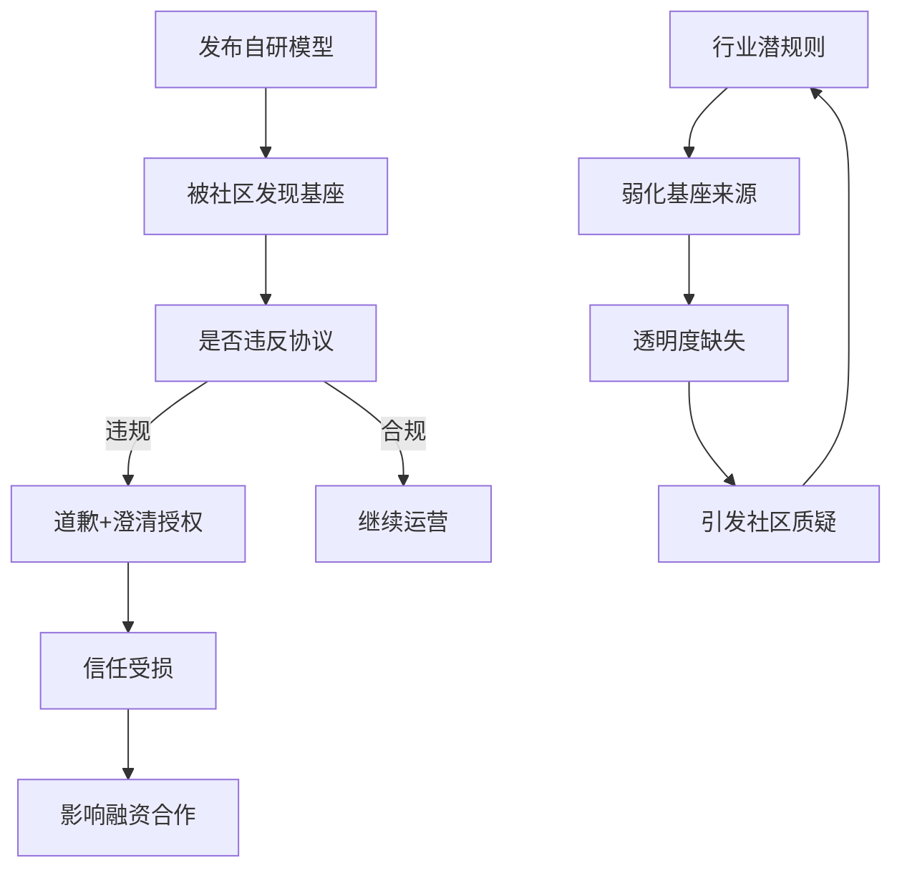

## 事件始末：一场不到24小时的反转大戏

3月20日凌晨，AI编程工具Cursor高调发布其"自研"代码模型**Composer 2**，宣称性能超越Claude Opus 4.6，且成本仅为竞品的1/10。

然而不到两小时，开发者 @fynnso 在调试Cursor API请求时，意外截获了模型的真实身份：`kimi-k2p5-rl-0317-s515-fast`。这个直白的命名几乎就是"Kimi K2.5 + 强化学习"的代名词。

月之暗面预训练负责人**杜羽伦**随即实测 Composer 2 的 tokenizer，发现与 Kimi tokenizer 完全一致，并在社交平台公开发帖质问 Cursor 联合创始人 Michael Truell：**"为什么不尊重我们的许可证，也没有支付任何费用？"**

该推文迅速引发热议，连**Elon Musk**都在相关帖子下留言：**"Yeah, it's Kimi 2.5"**（对，它就是Kimi 2.5）。

---

## 事件反转：一场"沟通失误"？

就在舆论持续发酵之际，Kimi官方账号 @Kimi_Moonshot 于3月21日凌晨发文，语气从指控转为祝贺：

> "恭喜Cursor团队发布Composer 2。我们很自豪看到Kimi K2.5提供了基础。看到我们的模型通过Cursor的持续预训练和高算力强化学习被有效整合，**这正是我们乐于支持的开源模型生态**。"

声明同时透露关键信息：**Cursor是通过Fireworks AI托管的强化学习与推理平台访问Kimi K2.5的，属于授权商业合作，许可证合规性经由Fireworks AI的商业协议保障。**

Cursor联合创始人**Aman Sanger**和开发者教育副总裁**Lee Robinson**随后跟进解释：

- 团队对多个基座模型进行了困惑度评测，**Kimi K2.5"证明是最强的"**
- 在此基础上叠加了**4倍规模的高算力强化学习**
- 最终模型中来自基座的算力约占**1/4**，其余**3/4**来自Cursor自身训练

两人均承认：**"博客发布时未提及Kimi基座是一个失误，下一个模型会在第一时间注明。"**

---

## 复盘时间线：那些被挖出的"铁证"

| 时间 | 事件 |
|------|------|
| 3月20日凌晨 | Cursor发布Composer 2，主打"自研" |
| 不到2小时后 | 开发者发现模型ID为kimi-k2p5-rl-0317-s515-fast |
| 杜羽伦发推质疑 | "为什么不尊重许可证，也没支付费用" |
| 马斯克下场确认 | "Yeah, it's Kimi 2.5" |
| 3月21日凌晨 | Kimi官方声明：属授权商业合作 |
| Cursor承认"失误" | 承诺下次注明基座来源 |

---

## 深度解读：开源协议为何被"忽视"？

### Kimi K2.5的协议红线

Kimi K2.5采用**修改版MIT协议**，其中明确规定：

> 如果使用该模型（包括衍生作品）的商业产品**月活超过1亿**或**月营收超过2000万美元**，必须在产品界面上显著标注"Kimi K2.5"。

而Cursor的实际数据令人警醒：

- **年化收入（ARR）**：20亿美元
- **月营收**：约1.67亿美元
- **是许可证门槛的8倍多**
- **界面标注情况**：只有"Composer 2"，无任何Kimi标识

### 这不是Cursor第一次

更深挖下去，这已是**Cursor第二次**被发现使用中国开源模型而未披露：

2025年11月，Composer 1发布时，社区就发现其**tokenizer与DeepSeek一致**，推理过程中也偶尔输出中文。当时Cursor同样未作说明，后来悄悄发布Composer 1.5翻篇。

---

## 行业震动：开源生态的信任危机

### 为何行业普遍存在"弱化基座"现象？

1. **叙事需要**：完全自研的故事更有吸引力，估值故事更漂亮
2. **利益驱动**：开源模型性能强大，合规成本被刻意忽视
3. **执行模糊**：API调用与"自研"之间的边界本就模糊

### Hugging Face CEO的警示

Hugging Face联合创始人兼CEO **Clément Delangue**评论称：

> "这是中国开源的又一次验证。**如今中国开源是塑造全球AI技术栈的最大力量**，前沿竞争不再只是谁从头训练，而是谁适配、微调、产品化得最快。"

---

## 国产AI的"高光时刻"

### Kimi K2.5：被全球最贵编程工具选中的基座

一个值得关注的时间巧合：

- **3月15日**：彭博社报道月之暗面正寻求**10亿美元**新一轮融资，估值约**180亿美元**，较三个月前翻四倍多，阿里巴巴和腾讯参与押注
- **3月20日**：全球估值最高的AI编程工具（Anysphere估值**293亿美元**）被发现以Kimi K2.5为基座

293亿美元估值的Anysphere在评测中认定Kimi K2.5是"最强基座"，在此基础上构建了其最核心的产品——**这或许是对月之暗面技术能力最直接的市场背书**。

### 不是孤例：日本乐天也翻车

就在Cursor事件余波未平之际，日本科技巨头**乐天集团（Rakuten）**发布的大模型**Rakuten AI 3.0**也被扒出：

- 开源社区开发者在Hugging Face的config.json中发现
- 参数规模、MoE结构**与DeepSeek-V3几乎一致**
- 初始上传时还**疑似故意删除了DeepSeek原有许可文件**

---

## 结语：透明与信任，AI时代的基石

Cursor事件给整个行业上了深刻一课：

**技术实力固然重要，但对开源规则的尊重，才是企业长远发展的基石。**

从DeepSeek到Kimi，中国开源模型正在全球AI生态中扮演越来越重要的角色。但与此同时，如何建立更完善的开源协议执行机制，如何在商业利益与开源精神之间找到平衡，仍是整个行业需要共同面对的课题。

正如Kimi官方所言：**"这正是我们乐于支持的开源模型生态。"**

唯有尊重贡献、恪守规则，才能让开源生态持续繁荣，推动AI行业健康发展。

---

*本文事件信息综合整理自InfoQ、知乎、量子位、虎嗅等平台，更多细节以官方回应为准。*
