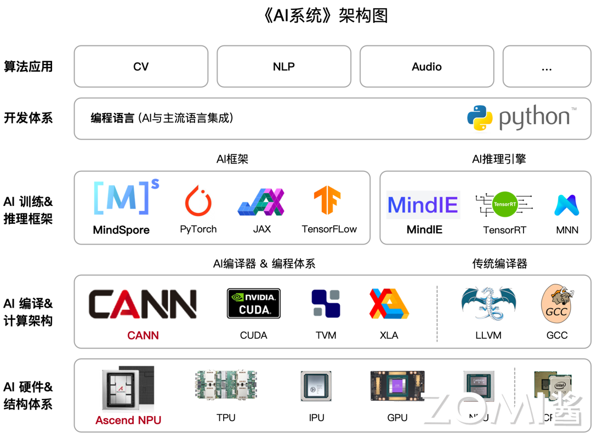
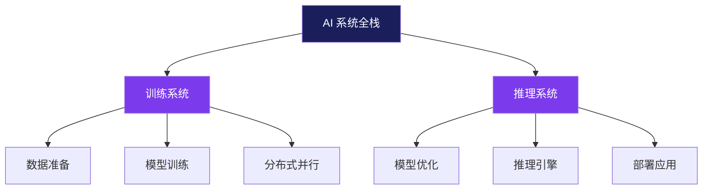
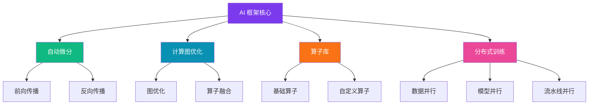
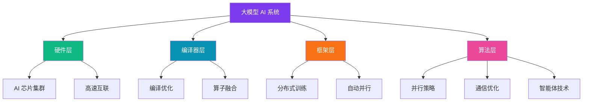

大家好呀！今天给大家带来一个超级硬核的 AI 系统开源课程分享～ 😊

如果你曾经好奇过大模型是怎么在 GPU 上跑起来的，想知道从芯片到框架再到应用的完整技术栈，那么这套课程绝对不容错过！🎉

## 🎯 这是一套什么样的课程？

这是一套专注于 **AI 系统全栈技术** 的开源课程，围绕 NVIDIA、昇腾等 AI 芯片构建的算力生态，系统性地梳理了从底层硬件到上层框架的完整知识体系。

简单来说，就是要帮你打通 AI 系统的"任督二脉"，让你不仅会用 AI 框架，更懂背后的系统设计原理！💪

## 📚 课程六大模块详解

这套课程共分为六大模块，循序渐进地带你深入 AI 系统的核心。让我们一起来看看每个模块都讲了什么吧～

### 第一部分：AI 系统全栈概述 🗺️

**这是入门的第一步！**

这部分会帮你建立对 AI 训练和推理全栈的整体认知，了解深度学习系统的系统性设计方法论。

**你会学到：**
- AI 系统的整体架构是什么样的
- 训练和推理系统有什么区别
- 如何系统性地设计深度学习系统

### 第二部分：AI 芯片硬核篇 💻

**这部分真的很硬核！⚠️**

从芯片基础讲起，深入介绍 AI 芯片的设计原理，而不是停留在"吊打英伟达"的口号层面。

**核心内容：**
- AI 芯片的基础架构
- 芯片设计如何考虑 AI 框架的前后端编译
- 不同 AI 芯片的特点和适用场景

> 💡 课程强调要脚踏实地，理解芯片设计的复杂性，而不是盲目对比性能参数。

### 第三部分：AI 编程与计算架构 🔧

**站在系统设计者的角度思考问题！**

这部分会带你深入编译器设计的核心，理解现代机器学习系统需要考虑的关键问题。

**重点知识点：**
- 中间表达（IR）的设计原理
- 编译器后端优化技术
- 如何设计高效的计算架构

### 第四部分：推理系统与引擎 🚀

**理论要落地，才能产生价值！**

这部分回归业务本质，讲解如何让 AI 系统真正在行业和企业中应用起来。

**实战干货：**
- 推理系统的核心算法
- 推理引擎的优化技巧
- 实际部署中的注意事项

> ✨ 课程强调"讲了太多原理身体太虚容易消化不良"，所以这部分特别注重实用性！

### 第五部分：AI 框架核心技术 🧠

**深入 AI 框架的"心脏"地带！**

任何一个 AI 框架都离不开这些核心技术，这部分会逐一拆解。

**核心技术点：**
- **自动微分**：AI 框架的基石，理解如何自动计算梯度
- **计算图与算子**：神经网络的表示方式
- **前端优化**：提升框架性能的关键
- **大模型分布式训练**：当前最热门的技术方向

### 第六部分：大模型与 AI 系统 🌟

**集大成者，俯瞰全栈！**

这部分汇总前面所有知识，讲解大模型时代 AI 系统的全栈优化。

**核心内容：**
- AI 集群的软硬件协同优化
- 编译器使能技术
- 分布式并行与集群通信算法
- 大模型领域的新技术演进（如智能体）

## 🎓 课程适合谁学习？

这套课程主要为以下人群设计：

✅ **高年级本科生** - 想深入理解 AI 系统底层原理  
✅ **硕博研究生** - 从事 AI 系统相关研究  
✅ **AI 系统从业者** - 希望提升系统设计和优化能力  

## 📋 先修知识要求

在开始学习之前，建议具备以下基础：

- **编程语言**：C++ / Python
- **计算机基础**：计算机体系结构
- **AI 基础**：人工智能基础课程

> 💡 如果某些知识点还不熟悉，可以先补充相关知识再学习，效果会更好哦！

## 🎁 课程特色亮点

### 1️⃣ 全栈覆盖，体系完整

从芯片到框架再到应用，覆盖 AI 系统的完整生命周期，帮你建立系统性认知。

### 2️⃣ 理论与实践并重

既有深度的原理讲解，也有实际案例和业务场景，避免"纸上谈兵"。

### 3️⃣ 紧跟前沿技术

涵盖大模型、分布式训练、智能体等最新技术方向，保持内容的前沿性。

### 4️⃣ 开源共享，持续更新

课程完全开源，鼓励社区参与和贡献，内容持续迭代优化。

## 📖 学习资源获取

这套课程的所有资源都是开源的，可以自由获取：

- **文字课程**：开源在 AISys 项目
- **系列视频**：托管在 B 站和 YouTube
- **课程 PPT**：开源在 GitHub

> 🎉 欢迎取用！也非常欢迎大家参与到这个开源项目中来～

## 💬 如何参与开源项目？

课程作者非常欢迎社区贡献：

1. **发现问题**：使用过程中发现 bug 或内容勘误
2. **提交 PR**：直接提交代码 PR 到开源社区
3. **交流互动**：在 B 站给 ZOMI 留言交流

> ⚠️ 温馨提示：请大家尊重开源和作者的努力，引用 PPT 内容请规范转载并标明出处哦！

## 🌈 学习建议

根据课程内容，给你几点学习建议：

**📌 循序渐进**  
按照六大模块的顺序学习，不要跳着学，因为知识点是层层递进的。

**📌 动手实践**  
理论学习的同时，多动手实践，用实际问题来验证理解。

**📌 建立知识网络**  
学完每个模块后，尝试画出知识图谱，建立完整的知识体系。

**📌 关注前沿**  
AI 系统领域发展很快，学习的同时也要关注最新的研究和技术动态。

## 🎯 总结

这套 AI 系统课程为我们提供了一个难得的学习机会，能够系统性地了解 AI 从底层芯片到上层应用的完整技术栈。

无论你是想深入理解大模型背后的系统原理，还是想提升自己的 AI 系统设计能力，这套课程都值得你花时间认真学习！💪

**最后送大家一句话：**  
> 技术学习没有捷径，但有好的课程可以让你少走弯路。加油，AI 系统探索者们！✨

---

**官方资源：**  
课程项目：AISys（GitHub 开源）https://infrasys-ai.github.io/aisystem-docs/  
视频教程：B 站 / YouTube 搜索 "ZOMI"  
PPT 下载：GitHub 开源项目

*如果觉得这篇文章对你有帮助，欢迎分享给更多需要的小伙伴～* 😊
