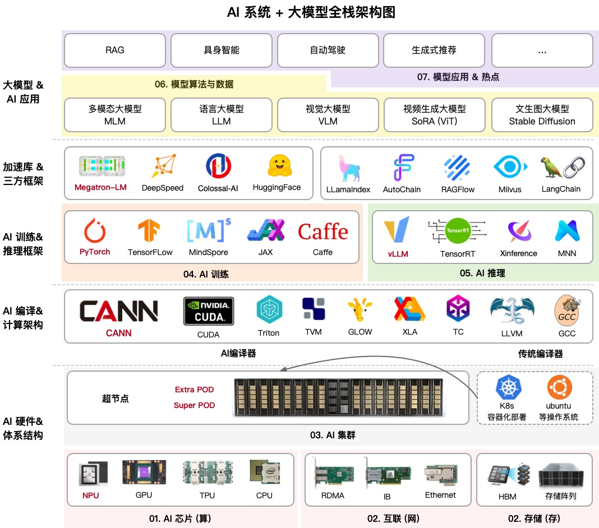
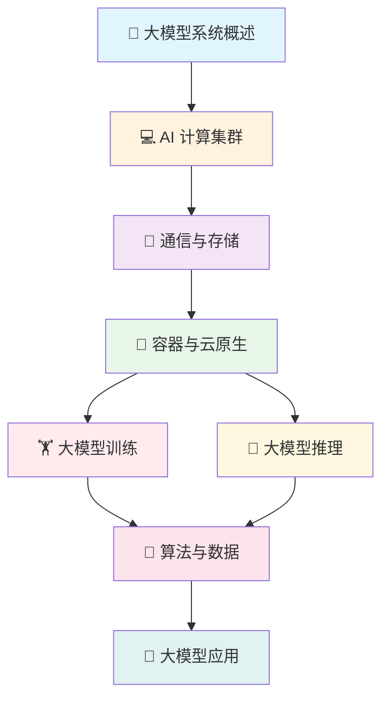
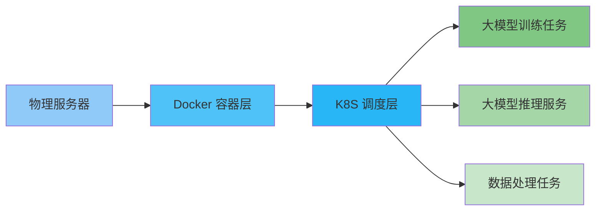
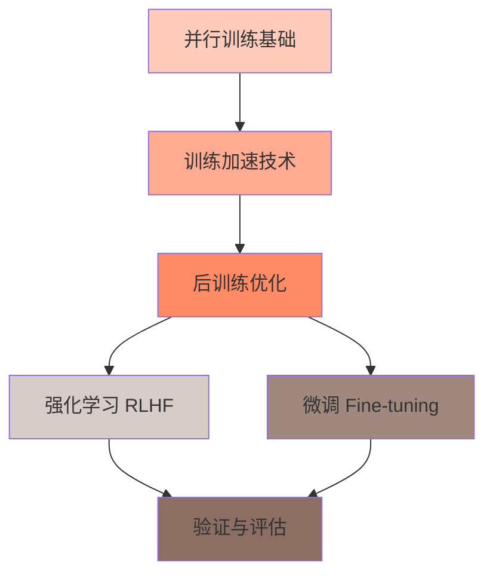
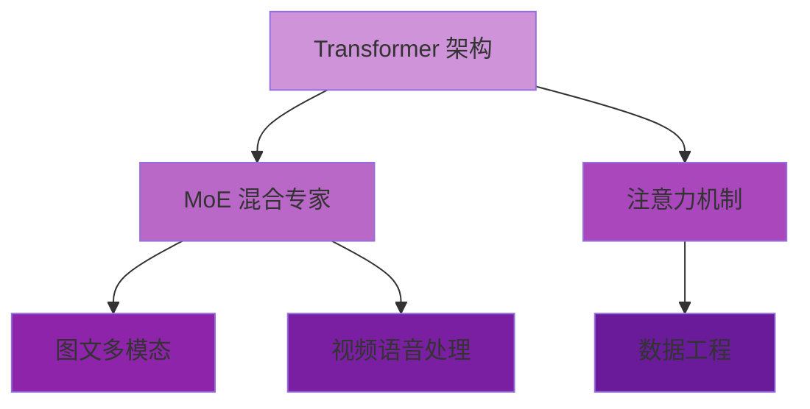
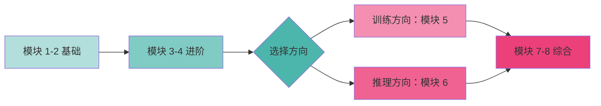

## 🌟 引言：大模型时代，Infra 工程师有多香？

你有没有想过，为什么 ChatGPT、Claude 这些大模型能够流畅地跟我们对话？🤔

背后离不开一群"看不见英雄"——**AI Infra 工程师**！他们搭建的算力基础设施，就像大模型的"神经系统"，支撑着整个 AI 系统的运行。

但问题来了：**想入门大模型 Infra，该从哪里开始？**

今天给大家安利一套**超系统的开源课程**——**AIInfra 大模型系统课程**！这套课程由华为昇腾技术专家 ZOMI 酱主导，完全免费开源，内容涵盖从计算集群到训练推理的全栈知识！🎉

---

## 📚 什么是 AIInfra 大模型系统课程？

简单来说，这是一套**围绕 NVIDIA、昇腾等芯片厂商构建的 AI 算力体系**，系统讲解大模型从底层硬件到上层应用的全栈内容。

课程的定位非常清晰：

- 🎯 **目标人群**：本科生高年级、硕博研究生、大模型系统从业者
- 📖 **先修要求**：C++/Python 基础、计算机体系结构、人工智能基础
- 💡 **核心目标**：通过实际问题和案例，帮你完整理解大模型的系统设计

用一句话总结：**这是可能是 B 站最系统的 AI 大模型 Infra 教程！**

***

## 🗂️ 课程八大模块，带你从零搭建大模型知识体系

整个课程分为**八大模块**，层层递进，构建完整的知识框架。让我用一张图帮你快速了解：

### 1️⃣ 大模型系统概述 - 建立全局认知 👀

**这是课程的"地图"模块**，帮你建立对大模型系统的整体认知。

你会了解到：

- 大模型系统的整体架构
- 课程的学习路径和方法
- AI Infra 工程师的核心工作内容

> 💡 **学习建议**：即使你是零基础，也要认真看完这部分，它能帮你建立正确的学习框架！

***

### 2️⃣ AI 计算集群 - 大模型的"发动机" 💪

大模型训练需要海量算力，单卡根本不够用！这时候就需要**计算集群**登场了。

**核心知识点**：

- GPU 集群的组成和架构
- 如何选择合适的计算资源
- 集群性能评估指标

想象一下：**成千上万张 GPU 卡协同工作**，就像一个超级大脑，这就是大模型训练的算力基础！

***

### 3️⃣ 通信与存储 - 大模型的"神经网络" 🕸️

大模型训练和推理的过程中，**网络通信是瓶颈**！这个模块会深入讲解：

**通信部分**：

- 📡 通信原理基础
- 🔌 网络拓扑设计
- 🌐 组网方案优化
- ⚡ 高速互联通信技术

**存储部分**：

- 💾 节点内存储架构
- 🗄️ 存储 POD 设计
- 📊 数据读写优化

> 🤓 **通俗理解**：如果把 GPU 比作"工人"，通信网络就是"传话系统"，存储就是"仓库"。传话越快、仓库越大，效率就越高！

***

### 4️⃣ 容器与云原生 - 大模型的"操作系统" 🐳

这是**实践性最强的模块**！从容器技术到 K8S 应用，手把手教你搭建环境。

**你会学到**：

- Docker 容器技术基础
- Kubernetes 核心概念
- **实战项目**：K8S 集群搭建与实践

> ✅ **学完这个模块，你就能自己搭建一个可用于大模型训练的 K8S 集群！**

***

### 5️⃣ 大模型训练 - 从并行到加速的核心技术 🏋️‍♂️

**训练是大模型的核心环节**！这个模块深入讲解训练的全流程。

**知识框架**：

**核心内容**：

- 🔄 **并行训练**：数据并行、模型并行、流水线并行
- ⚡ **加速技术**：混合精度训练、梯度累积、激活重计算
- 🎯 **后训练**：强化学习、人类反馈优化（RLHF）
- 🔧 **微调技术**：LoRA、P-Tuning 等高效微调方法
- 📊 **验证评估**：如何判断训练效果

***

### 6️⃣ 大模型推理 - 让模型真正"用起来" 🚀

训练好的模型如何高效部署？这是**当下最热的方向**！

**推理优化全链路**：

1. **基础概念**：推理的基本原理和流程
2. **加速技术**：KV Cache、量化、剪枝
3. **架构调度**：多卡多机推理优化
4. **输出采样**：控制生成质量和多样性
5. **模型压缩**：让大模型"瘦身"

**三大实践项目**：

- 📝 **长序列推理**：处理超长文本的场景
- 🎲 **输出采样**：控制生成结果的策略
- 🗜️ **大模型压缩**：模型蒸馏和量化实战

> 💡 **行业趋势**：推理优化是当前企业最紧缺的技能之一，学完这个模块就业竞争力满满！

***

### 7️⃣ 算法与数据 - 大模型的"大脑结构" 🧠

这个模块深入大模型的**算法本质**。

**知识脉络**：

- 🏗️ **Transformer 架构**：大模型的基石
- 🌟 **MoE 架构**：混合专家系统，效率翻倍
- 🖼️ **图文生成与理解**：多模态大模型
- 🎥 **视频语音大模型**：时序数据处理
- 📦 **数据工程**：数据清洗、标注、增强

***

### 8️⃣ 大模型应用 - 从技术到落地 🌈

**学以致用**！最后一个模块聚焦实际应用场景。

**你会了解到**：

- 🎯 **典型应用场景**：客服、写作、编程助手等
- 🚀 **进阶应用**：Agent 智能体、RAG 检索增强
- ⚠️ **挑战与伦理**：偏见、安全、隐私问题
- 🔮 **未来展望**：大模型的发展趋势

> 🌟 **这部分能帮你建立产品思维**，理解技术如何真正创造价值！

***

## 🎁 课程特色：为什么值得学？

### ✅ 完全开源免费

- 📝 文字课程开源在 AIInfra
- 📺 系列视频托管在 B 站和 YouTube
- 📊 PPT 开源在 GitHub

### ✅ 理论与实践结合

每个模块都有**配套实践项目**，不是纸上谈兵！

### ✅ 紧跟行业前沿

内容基于**NVIDIA、昇腾等主流芯片**，学完就能用在工作中！

### ✅ 社区活跃

可以在 B 站给 ZOMI 酱留言，还能参与开源项目贡献代码！👨‍💻

***

## 📖 如何开始学习？

### 学习资源获取

1. **文字课程**：访问 AIInfra 官网
2. **视频教程**：B 站搜索"ZOMI 酱"
3. **PPT 课件**：GitHub 开源项目
4. **实践代码**：开源社区提交 PR

### 学习路径建议

**推荐学习顺序**：

1. 先过一遍模块 1-2，建立整体认知
2. 重点学习模块 3-4，打好技术基础
3. 根据兴趣选择训练或推理方向深入
4. 最后学习模块 7-8，完善知识体系

***

## 💬 写在最后

大模型 Infra 是一个**既深且广**的领域，需要持续学习和实践。

这套 AIInfra 课程的价值在于：

- 🎯 **系统性**：覆盖从硬件到应用的全栈知识
- 💪 **实用性**：基于真实场景和主流技术
- 🌟 **开放性**：免费开源，社区共建

> 🚀 **学习建议**：不要只看不练！每个模块的实践项目一定要动手做，这样才能真正掌握！

如果你对大模型 Infra 感兴趣，或者已经在从事相关工作，这套课程绝对值得收藏学习！

**最后，向所有开源贡献者致敬！** 🙏 正是有了像 ZOMI 酱这样的技术布道者，我们才能如此便捷地学习前沿知识！

***

**📌 温馨提示**：

- 请大家尊重开源精神，引用 PPT 内容请规范转载标明出处
- 使用过程中发现 bug 或勘误，欢迎提交 PR 到开源社区
- 有任何问题，可以在 B 站给 ZOMI 酱留言哦！

## **一起加油，成为大模型时代的 Infra 高手！** 💪✨

**官方资源：**\
课程项目：AISys（GitHub 开源）<https://infrasys-ai.github.io/aiinfra-docs/>\
视频教程：B 站 / YouTube 搜索 "ZOMI"\
PPT 下载：GitHub 开源项目

*如果觉得这篇文章对你有帮助，欢迎分享给更多需要的小伙伴～* 😊

