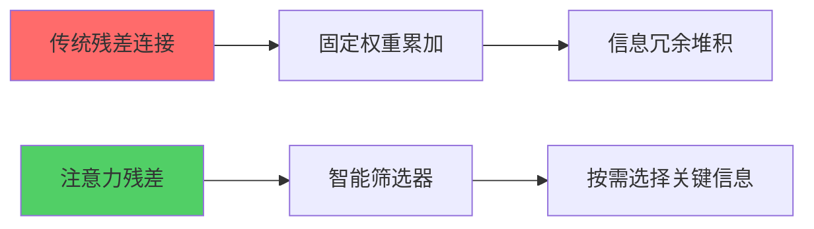
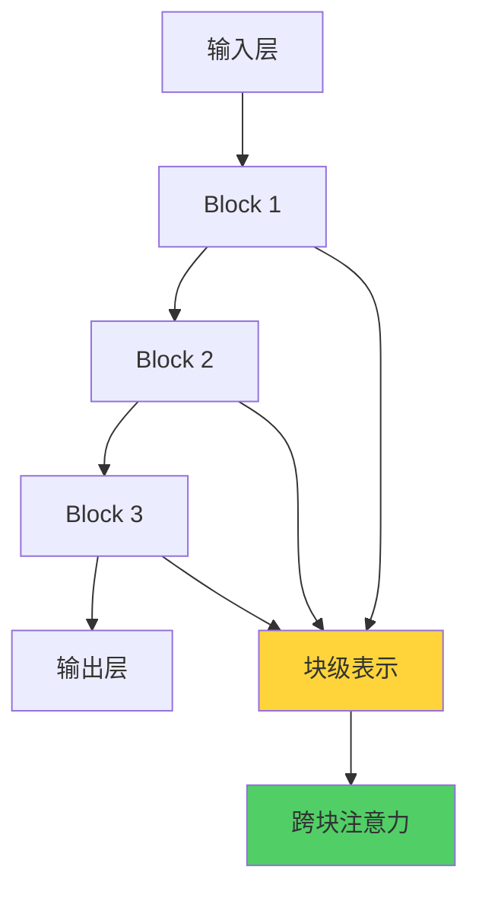

# 🎯 核心摘要

**2026 年 3 月 16 日**，月之暗面（Moonshot AI）旗下 Kimi 团队发布了一篇震撼全球 AI 界的技术论文，提出全新的**"注意力残差"（Attention Residuals）**机制，对深度学习领域沿用近十年的传统残差连接架构进行颠覆性重构。更引人注目的是，这篇论文的三位并列第一作者中，有一位**年仅 17 岁的深圳高中生陈广宇**。科技领袖埃隆·马斯克在社交平台公开点赞，称"Kimi 的工作令人印象深刻"。

---

## 📌 什么是"注意力残差"？

### 传统残差连接的局限性

要理解这项突破，首先需要了解**残差连接（Residual Connection）**的概念。

自 2015 年 ResNet 论文提出以来，残差连接已成为现代神经网络的基石。通俗理解，可以把大模型的信息处理过程想象成一条**多层传输带**：

- **传统方式**：每一层处理完信息后，把原始信息连同新的处理结果一起传给下一层
- **问题所在**：随着模型层数加深，传输带上会堆积大量冗余信息，真正重要的内容反而容易被"冲淡"

用 Moonshot AI 研究团队的话说，这就像**"搬运整座图书馆"**——效率低下且资源浪费。

### 注意力残差的创新

Kimi 团队提出的**注意力残差（Attention Residuals，简称 AttnRes）**机制，则是对这一底层逻辑的彻底重构：

**核心突破**：

- ✅ 引入**"智能筛选器"**，让当前层按需选择最值得参考的内容
- ✅ 使用**softmax 注意力机制**跨层级聚合信息
- ✅ 每个层可以**有选择地**获取之前层级的输出，而非无差别接收

如果说传统方式是"搬运整座图书馆"，那么**注意力残差就是"只带走最关键的几页参考文献"**。

---

## 🚀 技术优势：1.25 倍效率提升

根据论文披露的数据，注意力残差机制在**Kimi Linear 48B 模型**（3B activated parameters）上进行了验证，在 1.4T tokens 的预训练后取得了令人瞩目的成果：

| 指标 | 提升效果 | 具体数据 |
| --- | --- | --- |
| **训练计算量** | 减少约 **20%** | 等效 1.25 倍效率优势 |
| **推理延迟** | 增加不到 **2%** | 可忽略的性能开销 |
| **GPQA-Diamond** | 提升 **+7.5** | 36.9 → 44.4 |
| **Math** | 提升 **+3.6** | 53.5 → 57.1 |
| **HumanEval** | 提升 **+3.1** | 59.1 → 62.2 |
| **MMLU** | 提升 **+1.1** | 73.5 → 74.6 |

**Block AttnRes 优化**：
- 内存占用从 O(Ld) 降低到 O(Nd)
- 实验表明 N≈8 时能恢复大部分性能增益
- 成为可扩展的 drop-in 替换方案

### 为什么如此重要？

这项工作的颠覆性在于，它为后发的大模型提供了一条**摆脱"堆算力、堆参数"内卷的新路径**。

> 💡 **关键洞察**：在算力如同战略资源的今天，中国团队试图通过架构创新，从数学层面找到"弯道超车"的可能。

---

## 👨‍🎓 17 岁天才少年的崛起

### 陈广宇的成长轨迹

这篇论文最引人注目的故事，莫过于**17 岁深圳高中生陈广宇（Guangyu Chen）**的参与。

**关键时间节点**：

- 📅 **一年前**：真正深入接触 AI 研究
- 📅 **去年夏天**：远赴美国硅谷 AI 初创公司实习 7 周
- 📅 **去年 11 月**：加入 Kimi 团队参与核心研发
- 📅 **2026 年 3 月**：以共同第一作者身份发表重磅论文

### 非传统的成长路径

陈广宇的起步方式很"极客"：

1. 📚 研读经典论文
2. 💻 追踪 GitHub 开源项目
3. 🌐 在社交平台上分享对技术博客的反思

恰恰是这种开放的分享，成为了他命运的转折点。他在社交平台上的一篇技术反思，引起了一家硅谷 AI 初创公司 CEO 的注意，并在通过限时实验测试后，获得了宝贵的实习机会。

在 Kimi 团队，他不仅参与了核心研发，还展现了出色的创新能力。

---

## 🤝 团队协作的力量

### "同等贡献"的意义

在接受媒体采访时，陈广宇多次重复同一句话：

> **"不要'造神'，不希望被写成突出个人的故事。"**

他反复强调，这是一项**团队共同完成的研究**。

事实也确实如此。公开的论文附录清晰地显示：

- **Guangyu Chen（陈广宇）**
- **Yu Zhang（张宇）** - Kimi 架构核心开发者
- **Jianlin Su（苏剑林）** - RoPE 旋转位置编码提出者

**前三位作者均被标注为"同等贡献"（Equal contribution）**，与陈广宇并列的另外两人，都是业内公认的顶尖研究者。

### 现代科研的"大科学"属性

这份冷静与谦逊，在某种程度上，比技术突破本身更值得珍视。它表明这位年轻人深刻理解现代科研的底层逻辑：

> ✨ **在高度复杂的 AI 领域，任何重大的创新都不是灵光一现的孤胆英雄主义，而是高度组织化的团队协作与思想碰撞的结果。**

一篇有**37 位作者署名**的重磅论文，恰恰是当代 AI 研究"大科学"属性的缩影。

---

## 🌍 全球影响：中国 AI 的原始创新信号

### 马斯克的点赞意味着什么？

这并非一次简单的"隔空喊话"。它意味着：

1. 🎯 **中国 AI 初创公司的底层创新**，已经开始进入全球顶级科技领袖的视野
2. 🎯 **月之暗面**作为成立仅两年的"AI 四小虎"之一，能够在 Transformer 的底层架构上动刀
3. 🎯 向全世界展示其技术路径，这本身就是**中国 AI 产业从应用追随走向原始创新**的一个信号

### 人才储备的突破

陈广宇的出现，让这种信号增添了更多关于"未来"的想象：

> 🌟 **当一个 17 岁的中国高中生能够在全球最前沿的 AI 战场上与顶尖研究者并肩作战，并作出同等贡献时，它打破的不仅是对年龄的刻板印象，更是对中美 AI 人才储备差距的某种固有焦虑。**

---

## 🔬 技术细节深度解析

### Full AttnRes vs Block AttnRes

论文提出了两种实现方案：

#### 1️⃣ Full AttnRes（全量注意力残差）

- 每个层计算对所有前序层输出的注意力权重
- 性能最优，但计算和内存开销较大

#### 2️⃣ Block AttnRes（分块注意力残差）

- 将层级分组为多个块
- 块内通过求和聚合，块间应用注意力
- **大幅降低内存占用**，同时保留大部分性能增益

### 解决 PreNorm 稀释问题

Moonshot AI 研究团队指出，标准残差机制存在一个结构性问题：

> ❗ **所有先前层的输出以固定单位权重累加，导致隐藏状态幅度随深度增长，逐渐削弱任何单层的贡献。**

注意力残差通过以下方式解决这一问题：

- ✅ 保持输出幅度在深度上更有界
- ✅ 更均匀地在各层间分配梯度
- ✅ 缓解 PreNorm 稀释效应

---

## 🎓 数字原生代的崛起路径

陈广宇的经历，生动地勾勒出**数字原生代"天才"的崛起路径**：

1. 🌐 **不再受限于地理和年龄的隔阂**
2. 🌐 **通过开源社区、社交媒体和全球化的实习机会**
3. 🌐 **更早地与前沿知识接轨**
4. 🌐 **完成从"学习者"到"贡献者"的身份跃迁**

这种模式正在重塑全球 AI 人才的培养范式。

---

## 💡 启示：不要"造神"，要"造生态"

正如陈广宇所期望的，我们不应将这个故事简化为"天才少年"的爽文。它的真正价值在于，让我们看到了一个**充满活力的创新生态**：

| 生态要素 | 具体体现 |
| --- | --- |
| 🏢 **敢于投入底层研究的公司** | Kimi 团队 |
| 🤝 **开放包容的协作机制** | 共同一作制度 |
| 🌍 **跨越年龄和地域识别人才的新渠道** | 社交媒体与开源社区 |
| 🧠 **面对荣誉时保持清醒的年轻一代** | 陈广宇的谦逊态度 |

> 🎯 **不要"造神"，但要"造生态"。当更多的"陈广宇"们能够在这个生态中找到自己的位置，当更多的团队敢于向底层架构发起挑战，中国 AI 的未来，才真正值得期待。**

---

## 🔮 未来展望

马斯克的点赞或许会过去，但**"注意力残差"对 AI 效率的推动**，以及这位 17 岁少年对科研协作精神的诠释，才刚刚开始留下回响。

这项技术的意义在于：

- 🚀 为后发大模型提供了**摆脱算力内卷的新路径**
- 🚀 展示了**架构创新**在 AI 竞争中的关键作用
- 🚀 证明了中国 AI 团队在**原始创新**领域的潜力

---

## 📚 参考资料

1. **论文原文**：Chen, G., Zhang, Y., Su, J., et al. "Attention Residuals." arXiv:2603.15031 (2026)
   - 📄 [arXiv PDF](https://arxiv.org/pdf/2603.15031)
   - 💻 [GitHub 代码仓库](https://github.com/MoonshotAI/Attention-Residuals)
2. **月之暗面官方技术报告**
3. **权威媒体报道**：
   - 深圳特区报：《深圳 17 岁少年破解 AI 底层难题》
   - HK01：《马斯克激赞深圳 17 岁高中生扬威 AI 界》
   - 新浪财经、网易等多家媒体专访
4. **埃隆·马斯克社交平台公开评论**（2026 年 3 月 16 日）

---

**✨ 结语**：这是一个关于技术创新、人才培养和生态建设的故事。它告诉我们，真正的突破不仅来自于聪明的头脑，更来自于开放的生态、协作的精神和敢于挑战传统的勇气。

**中国 AI 的未来，值得期待！** 🇨🇳
